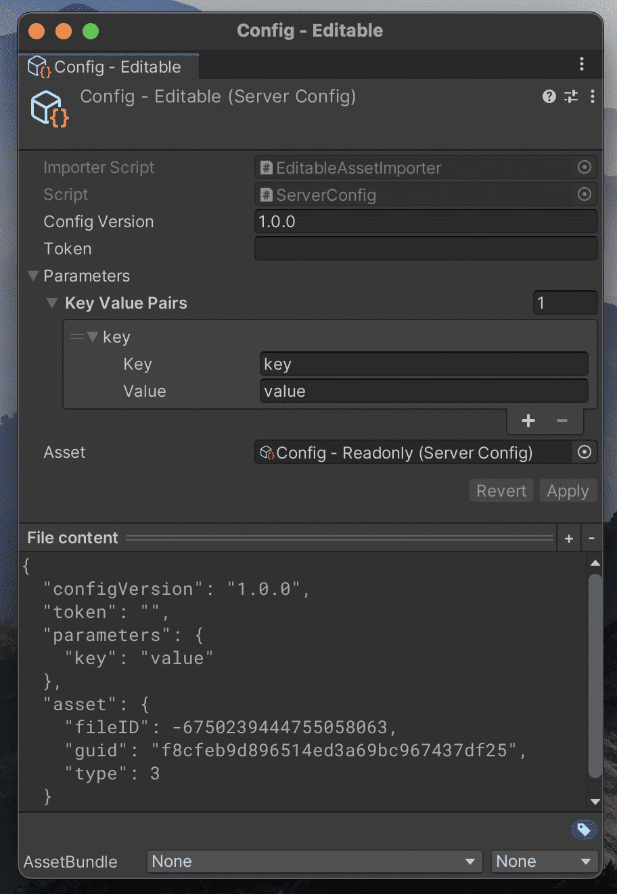

# Importables

> Solution to ease the process of creating simple Scripted Importers.

## Goals achieved

- Easily create text assets in the project browser.
- Make it easy to create an asset importer that allows user to edit asset in the inspector and apply those changes to the text file.
- Create examples of simple Asset Importer implementations (e.g, JSON Importer, CSV Importer). See the samples.
- Create a JSON Importer/Serializer that allows  deserializing JSON object/dictionary into unity serializable type. See JSON Importer samples.
- Create a `UnityEditor.ObjectPreview` to preview the file contents of text importers.

## Samples

See the _Samples~_ folder or Import package samples from the Unity Package Manager Window.

## API

| Class Name                       | Despription                                                                                                                         |
|----------------------------------|-------------------------------------------------------------------------------------------------------------------------------------|
| `CreateTextAssetAction`          | Utility method to create text file assets from menu items without the burden of managing project browser selection                  |
| `ScriptableObjectImporter`       | Base Importer for one to one text file -> `ScriptableObject` conversion                                                             |
| `ScriptableObjectImporterEditor` | Base Importer Editor that allows for applying changes from Scriptable Object Editor to text file                                    |
| `JsonSerializer`                 | Json Serializer that combines the features of Json.NET with `UnityEngine.Object` serialization of `UnityEngine.JsonUtility`         |
| `EditorJsonSerializer`           | Json Serializer that combines the features of Json.NET with  `UnityEngine.Object`  serialization of `UnityEditor.EditorJsonUtility` |
| `TextFilePreview`                | `UnityEditor.ObjectPreview` to preview the text file contents                                                                       |